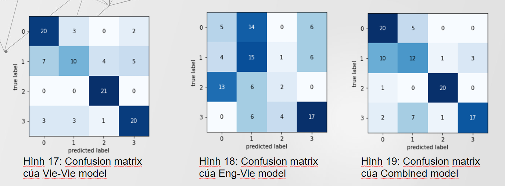

# Bài toán nhận diện cảm xúc của lời nói bất kể nội dung hay ngữ nghĩa của câu nói:
- Input : Một đoạn âm thanh tiếng việt dưới 10s.
- Output : Cảm xúc của người nói. (buồn, vui, tức giận, bình thường)
# Giải quyết vấn đề:
- Thu thập dữ liệu
- Xử lý dữ liệu
- Mô hình
- Kết luận
# Thu thập dữ liệu:
- Số lượng: 500 file 
- Chia đều vào 4 lớp:

      0.    Angry (Giận dữ)

      1.    Happy (Vui vẻ)​

      2.    Sad (Buồn)​

      3.    Neutral (Bình thường)​

- Mỗi đoạn ghi âm sẽ được gán nhãn X_Y.wav với X là cảm xúc của đoạn ghi âm, Y là số thứ tự
- Độ dài mỗi đoạn ghi âm trong khoảng 3-5s.​
- Mỗi đoạn ghi âm sẽ kèm theo một file transcripts X_Y.txt tương ứng.

# Xử lý dữ liệu
Trích xuất Mel Spectrogram :
- Là một cách biểu thị trực quan cường độ tín hiệu (độ lớn) của tín hiệu theo thời gian ở các tần số khác nhau hiện diện trong một dạng sóng cụ thể .
- Tính toán dựa trên 2 thang đo:
     - Thang đo Mel Scale
     - Thang đo Decibel Scale

# Mô hình
- TimedistributedCNN: 
  - Gồm 4 khối local feature learning block nối tiếp nhau​
  - Mỗi khối bao gồm: 

        1.Conv2D
        2.BatchNormalization
        3.Activation
        4.MaxPooling
        5.Dropout​
  - LSTM : gồm 256 units​
  - Dense: Activation = softmax
# Đánh giá 
Train và test trên các ngôn ngữ khác nhau sẽ cho ra kết quả không tốt.Phân loại khá tốt trên hai loại cảm xúc là neutral và sad.
Vẫn chưa phân biệt rõ được hai loại cảm xúc : Angry và Happy

